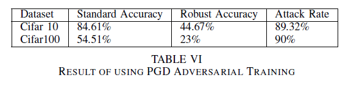
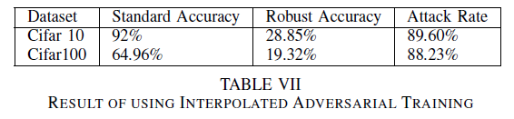
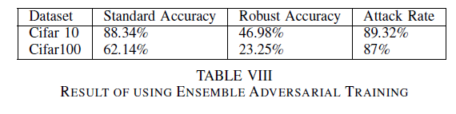

# RobustML-AdvTrain

This repository focuses on investigating novel Adversarial Training (AT) algorithms to enhance model robustness against adversarial attacks without compromising standard performance. The approach formulates the problem as a constrained optimization problem, converted into an unconstrained problem using the Karush-Kuhn-Tucker (KKT) approach with a trainable KKT coefficient lambda. The primary objective is to minimize the loss function while maintaining the standard performance of the model.

## Experimental Settings

The experimental setup involves utilizing CIFAR-10 and CIFAR-100 datasets with ResNet-18 as the Adversarial Training (AT) backbone. Adversarial samples are generated using a 10-step Projected Gradient Descent (PGD) with epsilon = 8/255 and a step size of epsilon/4. Attack settings include AutoAttack with an epsilon of 8/255 and norms of 'Linf' and 'L2'. Results are reported in terms of standard accuracy and adversarial robustness by the adversarially-trained ResNet-18 on the evaluated datasets.

## Project Sections

### 1) PGD Adversarial Training

This method defines a class named `LinfPGDAttack` responsible for generating adversarial examples using the PGD attack. The class has a `perturb` method that takes natural images and their labels as inputs and returns the corresponding adversarial images. The method also defines the `train` and `test` functions that perform training and testing on the model, respectively. The training process involves generating adversarial examples using the `LinfPGDAttack` class, and the trained model is saved in a checkpoint directory with the specified file name.

### 2) Interpolated Adversarial Training

This method trains a ResNet18 model on the CIFAR-10 dataset using a mixup training strategy and an adversarial training strategy. Mixup is a data augmentation technique that generates virtual training samples by taking linear combinations of pairs of training examples and their labels. The adversarial training strategy uses the `LinfPGDAttack` object to generate adversarial examples for the training data. The ResNet18 model is trained using the standard stochastic gradient descent (SGD) optimizer. Training is performed for multiple epochs, and the model is evaluated on both benign and adversarial test data. The code also includes utility functions for mixing up the data, calculating the loss, and evaluating the accuracy of the model.

### 3) Ensemble Model

To achieve higher accuracy, the proposed method introduces an ensemble model using Ensemble Adversarial Training (EAT). EAT combines adversarial training with ensemble methods to improve the robustness of models against a wide range of adversarial attacks. The process involves training the PGD model on both original and adversarial examples, training the interpolated model on both original and adversarial examples, combining the models into an ensemble by averaging their predictions, and evaluating the ensemble on a test set that includes both original and adversarial examples. The ensemble is expected to be more robust against the chosen attack method than either of the individual models.

## Results

